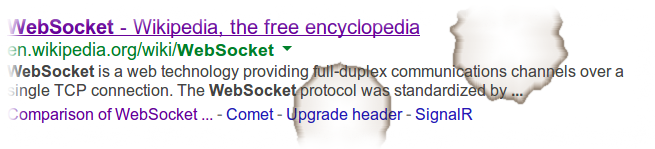

!SLIDE center small
# A Quick Definition
  

!SLIDE smaller bullets incremental
# What is WebSocket?

* A layer on TCP
* Full-duplex, stateful connection
* Stream of messages (rather than bytes)
* HTTP used for the initial handshake

!SLIDE small

    HANDSHAKE REQUEST

    GET /mychat HTTP/1.1
    Host: server.example.com
    Upgrade: websocket
    Connection: Upgrade
    Sec-WebSocket-Key: x3JJHMbDL1EzLkh9GBhXDw==
    Sec-WebSocket-Protocol: chat
    Sec-WebSocket-Version: 13
    Origin: http://example.com

!SLIDE small

    HANDSHAKE RESPONSE

    HTTP/1.1 101 Switching Protocols
    Upgrade: websocket
    Connection: Upgrade
    Sec-WebSocket-Accept: HSmrc0sMlYUkAGmm5OPpG2HaGWk=
    Sec-WebSocket-Protocol: chat

!SLIDE center small
# then exchange messages on the socket...

!SLIDE smaller bullets incremental
# Typical API Lifecycle Events

* `open` - session established
* `message` - new messages received
* `error` - transport error
* `close` - session closed
* Symmetrical on the client and server sides

!SLIDE smaller
# WebSocket Frame

     0                   1                   2                   3
     0 1 2 3 4 5 6 7 8 9 0 1 2 3 4 5 6 7 8 9 0 1 2 3 4 5 6 7 8 9 0 1
    +-+-+-+-+-------+-+-------------+-------------------------------+
    |F|R|R|R| opcode|M| Payload len |    Extended payload length    |
    |I|S|S|S|  (4)  |A|     (7)     |             (16/64)           |
    |N|V|V|V|       |S|             |   (if payload len==126/127)   |
    | |1|2|3|       |K|             |                               |
    +-+-+-+-+-------+-+-------------+ - - - - - - - - - - - - - - - +
    |     Extended payload length continued, if payload len == 127  |
    + - - - - - - - - - - - - - - - +-------------------------------+
    |                               |Masking-key, if MASK set to 1  |
    +-------------------------------+-------------------------------+
    | Masking-key (continued)       |          Payload Data         |
    +-------------------------------- - - - - - - - - - - - - - - - +
    :                     Payload Data continued ...                :
    + - - - - - - - - - - - - - - - - - - - - - - - - - - - - - - - +
    |                     Payload Data continued ...                |
    +---------------------------------------------------------------+

!SLIDE smaller bullets incremental
# What kind of payload?
  
* Text messages encoded as UTF-8
* Binary messages
* Control frames: close, ping, pong
* Continuation frames

!SLIDE smaller bullets incremental
# Message vs Frame
  
* A message can be broken into fragments
* Protocol implementation deals with fragments
* Applications mainly work with messages
* Good to know if tracing TCP traffic

